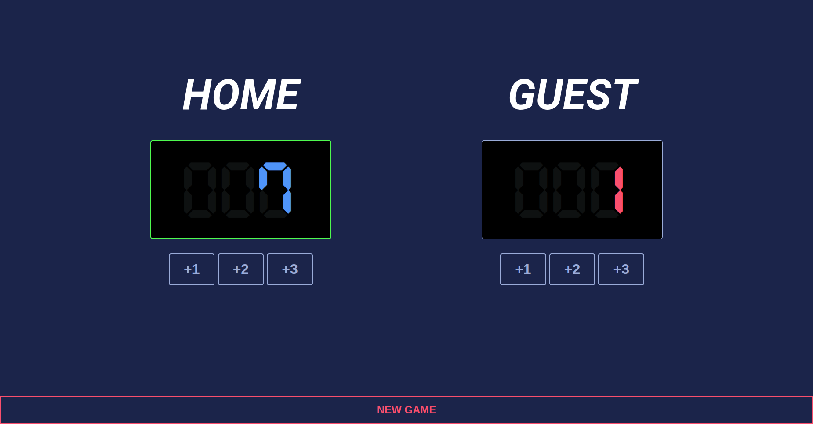

# Scrimba JavaScript Counter App

The second project (and first solo project - built from scratch) from [Scrimba's Learn JavaScript course](https://v2.scrimba.com/learn-javascript-c0v). 

## Website Link

Visit the live website [here](https://paulomborges.github.io/scrimba-js-scoreboard/).

### Extras

- New Game button
- Highlight the winner
- Different design
- Responsive
- Add favicon

